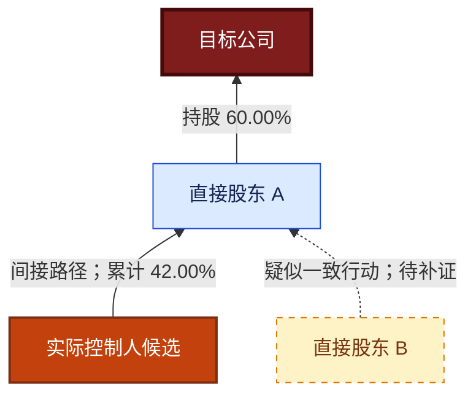

# 股权结构分析

## 目标

为投资团队生成“结论先行、图表结合、证据可追溯”的控制权核查报告。将工商事实、产品直接结论、数学计算与分析推断严格分开，不把关系线索写成已证实的一致行动或关联交易。

## 当前能力边界

`P0020023`、`P0020129`、`P0020014`、`P0020019`、`P0020031`、`P0020044` 已通过真实企业查询；`P0090011` 已连通网关，但阳光电源、招商银行均返回产品状态 `3`（查询失败），不能作为稳定证据源。`P0020023` 已能提供向上股东和向下投资的递归结构，但高层级响应可能很大，必须渐进扩展。

- 默认交付“增强型初步核查报告”；只有核心路径到达合理终点且完成交叉验证时，才称为完整分析。
- 不得用通用 `query_cisp_product` 冒充专用工具，也不得用关系网络替代缺失的正式股权穿透路径。
- `result_code == "00000"` 只表示网关请求成功；必须同时检查 `product_status`：`4`=有结果，`1`=无结果，`3`=产品查询失败。
- 产品状态 `1` 写“本次查询未返回相关结果”；状态 `3` 写“产品查询失败/当前不可用”。两者都不得写“无该关系”。

## 工作流

### 1. 锁定目标主体

优先使用企业全称或统一社会信用代码。名称不完整或存在歧义时，调用 `p0010068_fuzzy_search_company_name` 获取候选，再让用户或可靠标识完成消歧。调用 `p0010010_query_business_profile` 核验名称、信用代码、登记状态并取得 `basicList[].entId`；不得自行推算 `eid/entId`。

记录数据查询时点。历史时点分析必须明确基准日期；接口只有当前快照时，不得把当前股权回填为历史股权。

### 2. 建立基础事实层

调用 `p0010058_query_business_basic_deep` 获取股东、主要人员、变更、对外投资等深度工商信息。按需调用 `p0010059_query_business_basic_brief`，至少覆盖 `shareholder`、`person`、`alter`，并在风险范围内补充股权出质、冻结等工具 schema 支持的类型。

完整投资尽职调查默认调用 `p0020021_query_single_point_related_info` 且选择投资与任职两类关系；用户明确缩小范围时再单独选择。调用 `p0990022_query_supplier_relationships` 获取供应商关联候选，但不得据此直接认定已发生关联交易。

### 3. 构建多层股权图

先调用 `p0020023_query_equity_penetration(level="1", ratio="5")` 建立直接股东与直接对外投资骨架。只有控制链未到终点或用户要求更深穿透时，才将 `level` 逐级提高至 2、3，极端情况下最多 5；不得因为接口默认值是 3 就直接拉取完整三级树。`ent_info` 只传已核验的企业全称或统一社会信用代码；`level` 和 `ratio` 都传字符串。`ratio` 是企业股东节点的最低持股比例阈值，因阈值未返回某节点只能写“低于本次展示阈值或未返回”，不得写“不存在”。目标公司本身不一定作为根节点返回，必须以查询主体另建根节点，并分别挂接 `upList[]` 股东树和 `downList[]` 投资树。

再调用 `p0020129_query_controller_and_ubo` 取得产品直接结论，并调用 `p0020019_query_suspected_controller`：默认用 `path_type="0", final_flag="0"` 取得企业级控制候选；若候选仍是企业、国资平台或路径未到终点，再用 `final_flag="1"` 穿透到底并并列展示两次结果。

调用 `p0090011_query_ubo_full_paths` 获取最终受益人全路径。若产品状态为 `3`，可改用已核验的统一社会信用代码重试一次；仍失败便停止重试，记录能力缺口并回退到 `P0020019`、工商股东和 `P0020031`，不得声称已取得最终受益人全路径。

`p0020044_query_intercompany_relationship` 只用于已知主体对的投资/任职关系核验。`p0020031_query_multi_point_relationships` 采用渐进策略：先以 `depth="2", relation_type="2"` 查询投资路径；只有直接结果不足时才升至深度 3，再按需以 `relation_type="0"` 加入任职关系。深度 5 可能产生大量重复路径，不作为默认首查。

统一建立图数据：

- 节点：企业、自然人、合伙企业、基金/资管、国资主体、境外主体、其他组织。
- 边：直接持股、间接持股、投资、任职、法定代表人、控制、受益所有、集团、供应商及疑似关系。
- 证据：产品码、工具名、原始字段路径、查询时点；保留缺失值，不以常识补齐。
- 去重：优先按统一社会信用代码或 CISP 企业 ID 去重，名称只作次级键。

按产品分别归一化方向和路径：

- `P0020019.linkList[]` 中实测 `direction="-1"` 时，原始记录常以“被投企业”为 `startId`、“股东/控制人”为 `endId`；绘制持股边时转换为 `endId → startId`，并以节点名称复核。相同 `startId + endId + directPercent + direction` 会重复，图上合并，但原始证据保留。
- `P0020023.upList[]` 和 `downList[]` 都是递归节点树；以 `nodeList[]` 继续遍历，以 `grade` 校验层级，以 `hasNextNode` 识别是否还有子节点。向上树绘制 `股东节点 → 下一级被投企业`，向下树绘制 `上一级投资企业 → 被投节点`。`type="0"` 表示自然人，`type="1"` 表示非自然人；`fundedRatio` 保留上游原值。文档将部分字段标为数字或对象，但真实响应可能给字符串和数组，解析时不得强制改写原始类型。产品状态为 `4` 时任一方向仍可能是空列表，只能表述该方向本次未返回节点。
- `P0020031.relation[]` 的投资边实测为 `startId` 投资 `endId`；`table[]` 按 `roadId` 和原始顺序还原完整路径。相同边可出现在多条路径中：图上去重，路径表不得去重后再错误求和。
- `P0020044.relationship[]` 只证明主体间是否存在“股权投资/人员任职”关系，不提供可用于比例计算的完整路径。

向上逐层遍历至自然人、国资终点、公开披露的分散持股上市主体、数据断点或用户指定深度。使用 `P0020023` 时逐级扩展且最多 5 层，并维护已访问节点以阻止循环。数据量过大时保留所有控制路径，普通小股东可按用户阈值折叠。实际查询层级、比例阈值和被折叠节点数量只记录到内部工作底稿或局限说明，不在报告头部生成范围摘要。

只有路径上每段持股比例都存在时，才计算单一路径的穿透持股比例：各段比例相乘。合并多条路径前检查路径独立性，无法排除重复计算时分别展示而不求和。

### 4. 核验控制权与受益所有权

按以下顺序形成结论：

1. 产品直接返回的实控人/最终受益人结论及完整路径。
2. 工商股东和穿透路径对主体、层级、比例的交叉核验。
3. 疑似实控人、共同投资任职、企业间关系和集团信息的反向验证。
4. 股权变更、出质、冻结等对控制权稳定性的影响。

把 `P0020019.controlNodeList[].percent` 和 `P0020129` 的控制人/受益人视为产品直接结论，不标成模型计算。只有从完整且独立的持股路径逐段相乘得到的比例才标为 `[计算]`。若 `final_flag="0"` 返回企业级控制人、`final_flag="1"` 返回其最终国资或自然人终点，应表述为不同穿透层级，不直接判为冲突。

上市公司场景中，`P0020129.finalBefList[]` 可能返回较宽的人名集合。没有 `P0090011` 全路径或其他可复核证据时，统一称为“产品返回的最终受益人名单”，不得逐人写成已确认最终受益所有人。

分别描述股权控制、表决权/协议控制、管理层控制和受益所有权。法定代表人、董事长或最大股东身份均不能单独证明其为实际控制人。

### 5. 识别一致行动与隐性关联线索

现有产品清单没有名称明确指向“一致行动协议/一致行动人”的标准产品。仅当接口字段或可靠披露明确给出一致行动关系时，才写“已识别一致行动人”；否则写“疑似一致行动线索”，并列示触发依据，例如共同投资路径、高度重合任职、同一集团、稳定同步持股变更或产品返回的疑似关系。

将隐性关联按证据强度分层：

- A：多个独立产品一致，或直接关系产品与工商事实相互印证。
- B：单一直接产品结果，字段和主体明确。
- C：共同人员、共同投资、集团或供应商等组合线索，需要协议、流水、合同或访谈补证。

不得将同名、同地址、同电话、单次任职重合或模型推断单独写成确定关联。

调用 `p0020014_query_suspected_relationships` 时必须显式指定 `relation_type`，按 `contactSus`、`telSus`、`emailSus`、`websiteSus`、`registSus` 的顺序按需查询，`domainSus` 最后调用。读取路径为：`suspectList[].sus.<type>` 是目标主体被匹配的电话/地址/域名等值，`suspectList[].<type>[]` 才是候选企业。`reportYear` 实测可能是年份或完整日期，只按上游原值展示。

同邮箱域名的噪声通常最高；返回量达到 200 条时标记“结果可能截断”，只抽取与股东、控制人、董监高、集团成员重合的候选进入正文，其余放入待筛选清单。注销企业仍可作为历史线索，但必须显示登记状态。

### 6. 评估关联交易风险

先形成“关联方候选清单”，再检查是否存在供应、采购、资金、担保、资产转让或其他交易证据。只有关系没有交易时，写“关联交易核查对象”，不得写“存在关联交易”。

重点提示控制人交叉持股、员工/高管代持线索、共同控制、循环持股、层级过深、比例断点、突击变更、股权出质冻结、供应商与股东/高管重合等风险。

### 7. 生成报告

严格采用本文“股权结构分析报告规范”中的叙述顺序、证据标签、表格和 Mermaid 图规范。结论必须标注为以下之一：

- **事实**：工具原始结果直接支持。
- **计算**：公式、输入比例和路径完整可复算。
- **推断**：多项线索支持但缺少直接证据。
- **未知**：接口未覆盖、无结果、字段缺失或冲突未解。

报告先回答“谁控制、通过什么路径、结论有多可靠、最需要补证什么”，再展开过程。对接口冲突并列展示，不擅自选择有利结论。

## 完成条件

完整分析至少满足：目标主体唯一、核心股权路径到达合理终点、实控人与受益所有权分别核验、疑似一致行动和关联方线索已分级、图表与路径表一致、所有关键结论可回溯到产品码和字段、局限与补证清单明确。

任一核心条件不满足时交付“初步核查报告”，并明确缺失工具、数据断点和下一步，而不是降低证据标准。

## CISP 产品优先级与 MCP 开发矩阵

### 使用说明

本矩阵依据 `/Users/ice/2work/code/1_mcp/cisp-mcp/docs/prod_list.json`（480 个产品）中的产品名称，以及当前仓库 `src/cisp_mcp/interfaces.py`、`src/cisp_mcp/server.py` 的专用工具注册情况整理，基准日期为 2026-08-03。

“建议权重”总计 100%，表示该产品对本技能目标的相对贡献和开发/调用预算，不代表数据准确率、法律意义或接口可用率。产品清单没有请求参数、返回 schema、样例或字段口径；名称所暗示的能力必须在开发时通过产品文档与真实响应验证。

“已开发”仅指已有产品专用 MCP tool。通用 `query_cisp_product` 可透传任意产品码，但没有产品级 schema、参数校验和字段说明，不计为专用工具开发完成。

### 推荐组合与权重排序

| 排名 | 权重 | 产品码 | 产品名称 | 角色 | MCP 状态 | 专用工具/待开发建议名 |
| ---: | ---: | --- | --- | --- | --- | --- |
| 1 | 15% | `P0020023` | 企业股权穿透信息查询 | 多层股权主图和路径骨架 | **已开发，真实接口通过** | `p0020023_query_equity_penetration` |
| 2 | 13% | `P0020129` | 企业实控人和最终受益人查询 | 实控人与最终受益人直接结论 | **已开发，真实接口通过** | `p0020129_query_controller_and_ubo` |
| 3 | 11% | `P0090011` | 企业最终受益人信息查询-全路径版 | 受益所有权全路径及比例复核 | **已开发，产品查询失败** | `p0090011_query_ubo_full_paths` |
| 4 | 9% | `P0020044` | 企业间关联关系查询 | 核验两主体间关系路径 | **已开发，真实接口通过** | `p0020044_query_intercompany_relationship` |
| 5 | 8% | `P0020014` | 企业疑似关系信息查询 | 发现隐性关联候选 | **已开发，真实接口通过** | `p0020014_query_suspected_relationships` |
| 6 | 7% | `P0020031` | 企业多点关联信息查询 | 多主体共同路径与交叉关系 | **已开发，真实接口通过** | `p0020031_query_multi_point_relationships` |
| 7 | 7% | `P0020019` | 企业疑似实际控制人信息查询 | 实控人反向校验和异常提示 | **已开发，真实接口通过** | `p0020019_query_suspected_controller` |
| 8 | 6% | `P0010058` | 企业工商基本信息查询（深度） | 股东、人员、变更、投资的基础事实 | **已开发** | `p0010058_query_business_basic_deep` |
| 9 | 5% | `P0020021` | 企业单点关联信息查询 | 投资和任职关系扩展 | **已开发** | `p0020021_query_single_point_related_info` |
| 10 | 4% | `P0980069` | 集团成员信息查询（新企鉴） | 集团边界与成员补全 | 待开发 P1 | `p0980069_query_group_members` |
| 11 | 4% | `P0990044` | 企业股东变更信息查询 | 控制权历史变化与稳定性 | 待开发 P1 | `p0990044_query_shareholder_changes` |
| 12 | 3% | `P0010059` | 企业工商基本信息查询（简项） | 定向补充股东、人员、变更、出质冻结 | **已开发** | `p0010059_query_business_basic_brief` |
| 13 | 3% | `P0990022` | 供应商关联关系 | 关联交易候选与供应链重合线索 | **已开发** | `p0990022_query_supplier_relationships` |
| 14 | 3% | `P0010010` | 企业工商照面信息查询 | 主体核验及 `entId` 解析 | **已开发** | `p0010010_query_business_profile` |
| 15 | 2% | `P0090010` | 企业控股股东图谱（图片）信息查询 | 对自建图的视觉交叉检查 | 待开发 P2 | `p0090010_query_controlling_shareholder_graph` |

当前专用工具代码覆盖上述建议权重的 90%。7 个核心股权工具均已开发，其中 6 个已取得真实业务结果；`P0090011` 在两个测试主体上均返回产品状态 `3`。当前可以构建多层股权主图并完成控制人交叉核验、关系网络和隐性关联筛查，但不能默认承诺稳定的最终受益人全路径。

### 最佳调用编排

1. **主体锁定**：名称不确定时先用 `P0010068` 消歧，再以 `P0010010` 核验主体和 `entId`。
2. **基础事实**：并行调用 `P0010058`、`P0010059`；至少取得股东、主要人员、变更及出质冻结相关字段。
3. **主图骨架**：先调用 `P0020023(level="1", ratio="5")`，构建直接股东与直接投资两棵树；控制路径未到终点时再把 `level` 逐级提高，避免直接请求三级或五级大树。
4. **控制结论**：并行调用 `P0020129` 与 `P0020019(final_flag="0")`；企业级控制候选未到终点时追加 `P0020019(final_flag="1")`。
5. **全路径尝试**：调用 `P0090011`；状态 `3` 时只允许换信用代码重试一次并记录回退，不阻塞后续分析。
6. **定向关系核验**：从前三层选择关键主体对，先用 `P0020044` 判断投资/任职关系，再用 `P0020031(depth="2", relation_type="2")` 取得低噪声投资路径；证据不足时逐级扩展。
7. **隐性关联筛查**：按关系类型调用 `P0020014`，只把与控制权候选重合的高相关结果提升到正文。
8. **交易与稳定性**：按需调用 `P0020021`、`P0990022` 和 `P0010059`，检查供应商重合、股权变更、出质冻结；未开发的集团/历史工具列入缺口。
9. **输出**：归一化、去重、重建路径后生成 Mermaid 图和必要表格；证据映射只留在内部工作底稿，不得直接把原始关系数组倾倒成图。

### 真实接口验证基线

基准日期为 2026-08-03。以下仅用于固化解析和调用策略，不是对测试公司的持续性投资结论；后续查询必须使用当次响应。

| 场景 | 阳光电源股份有限公司 | 招商银行股份有限公司 | 固化规则 |
| --- | --- | --- | --- |
| 主体核验 | 信用代码 `913401001492097421`，在营 | 信用代码 `9144030010001686XA`，在营 | 名称必须与 `P0010010.basicList[].orgName` 精确匹配 |
| `P0020023` | 默认三级、阈值 5 时：向上 2 个节点、向下 1,420 个节点；一级查询保留 2 个直接股东和 87 个直接投资节点 | 默认三级、阈值 5 时：向上 7 个节点、向下 499 个节点；一级查询保留 3 个直接股东和 15 个直接投资节点 | 默认实务调用固定从 `level="1", ratio="5"` 开始；`upList` 与 `downList` 分树解析，按需逐级扩展 |
| `P0020129` | 控制人和受益人均返回曹仁贤 | 控制人返回国务院，受益人返回多人名单 | 名称型黑盒结论必须与路径产品交叉验证 |
| `P0020019` | 控制候选曹仁贤，`percent=30.46`，与工商股东比例一致 | `final_flag=0` 返回招商局集团有限公司 `26.32`；`final_flag=1` 返回中华人民共和国国务院 `35.403271` | 企业级控制人与最终国资终点分层展示；比例标为产品事实 |
| `P0090011` | 名称和信用代码均返回状态 `3` | 名称返回状态 `3` | 网关成功不等于产品成功；一次标识回退后停止 |
| `P0020044` | 与阳光新能源开发股份有限公司返回股权投资、人员任职 | 与招商局集团有限公司返回股权投资、人员任职 | 只作二元关系核验，不据此计算路径比例 |
| `P0020031` | 深度 5、投资+任职产生 14 条 road；深度 2、仅投资降为 2 条 | 深度 5、投资+任职产生 17 条 road；深度 2、仅投资降为 1 条 | 默认低深度、仅投资，逐级放宽，按 `roadId` 重建路径 |
| `P0020014` | `contactSus` 返回 3 个候选；`domainSus` 返回 200 个候选 | `registSus` 本次无候选但产品状态为 `4` | 有结果状态可包含空候选；域名结果达到 200 条视为可能截断 |

仍需排查 `P0090011` 产品状态 `3` 的上游原因，并继续验证 `P0020023` 在循环持股、交叉持股、超大树和状态 `1/3` 场景下的生产边界。增强项依次为 `P0980069` 集团成员、`P0990044` 股东变更、`P0090010` 控股股东图片交叉检查；图片不能替代结构化路径。

### 同类候选与取舍

以下产品名称相关，但不应一次性全部开发。先对候选做同一企业的 schema 与结果对比，再选择字段最完整、权限稳定、非客户定制的产品：

| 能力 | 首选 | 候选/备选 | 取舍原则 |
| --- | --- | --- | --- |
| 股权穿透 | `P0020023` | `P0020016`、`P0990023` | 优先标准产品和结构化路径；`P0990023` 为“国网”命名的定制产品 |
| 最终受益人 | `P0090011` + `P0020129` | `P0020020`、`P0020024`、`P0090001`、`P0090002`、`P0090012` | 全路径用于复算，组合产品用于直接结论；详/简版仅在字段或成本更优时替换 |
| 实际控制人 | `P0020129` + `P0020019` | `P0090008`、`P0990067` | 直接结论与疑似结果交叉验证；`P0990067` 为“中证定制” |
| 最大股东链 | `P0020023` | `P0970035` | 最大股东链不能替代全部控制路径，可作低成本预筛 |
| 企业关系 | `P0020044`、`P0020014`、`P0020031` | `P0020025`、`P0020026`、`P0020039`、`P0020040`、`P0020041`、`P0990058`、`P0990059` | 优先一次返回可解释路径和证据的标准产品 |
| 集团识别 | `P0980069` | `P0020029`、`P0020030`、`P0980048`、`P0980049`、`P0980050`、`P0980051`、`P0980067`、`P0980068` | 选择集团 ID、成员角色和控制边最完整的组合，避免重复调用 |
| 股东变化 | `P0990044` | `P0080004`、`P0990043` | 优先能明确返回变更前后股东及比例的产品 |

`P0990064`/`P0990065`（泸州银行）、`P0990067`（中证）、`P0990068`（乐山商业银行）等客户定制接口，仅在账号权限、业务口径和授权范围明确时使用，不作为通用技能默认依赖。

### 当前已开发的相关工具

| 产品码 | MCP tool | 本技能用途 | 当前边界 |
| --- | --- | --- | --- |
| `P0010068` | `p0010068_fuzzy_search_company_name` | 名称消歧 | 不进入 100% 核心权重，按需调用 |
| `P0010010` | `p0010010_query_business_profile` | 主体核验、解析 `entId` | 不提供多层路径 |
| `P0010058` | `p0010058_query_business_basic_deep` | 股东、人员、投资、变更基础事实 | 返回是目标主体的深度快照，不等于完整穿透 |
| `P0010059` | `p0010059_query_business_basic_brief` | 按类型补充股东、人员、变更、出质冻结 | 需按工具 schema 选类型 |
| `P0020021` | `p0020021_query_single_point_related_info` | 投资与任职关联 | 单点关系不等于控制链 |
| `P0020023` | `p0020023_query_equity_penetration` | 向上股东、向下投资的递归穿透主图 | 已实测；默认先查 1 层，阈值筛选未返回不等于关系不存在 |
| `P0020014` | `p0020014_query_suspected_relationships` | 同电话、地址、网站、邮箱等隐性关联线索 | 已实测；候选可能为空或截断，不等于控制/交易事实 |
| `P0020019` | `p0020019_query_suspected_controller` | 疑似实控人与控制路径反向校验 | 已实测；需处理 `direction`、重复边和两种 `final_flag` |
| `P0020031` | `p0020031_query_multi_point_relationships` | 多企业/人员共同关系网络 | 已实测；合计最多 10 个主体，默认低深度渐进查询 |
| `P0020044` | `p0020044_query_intercompany_relationship` | 最多 10 家企业间投资和任职关系 | 已实测；只返回关系类别，不提供完整比例路径 |
| `P0020129` | `p0020129_query_controller_and_ubo` | 实控人和最终受益人直接结论 | 已实测；名称型黑盒结论，路径与比例需补证 |
| `P0090011` | `p0090011_query_ubo_full_paths` | 最终受益人全路径与比例 | 工具已连通，但两个真实主体均返回产品状态 `3` |
| `P0990022` | `p0990022_query_supplier_relationships` | 供应商关联候选 | 关系不等于交易事实 |

### MCP 工具验收分级

- **已开发**：完成产品定义、专用 `@mcp.tool()`、核心参数 schema/校验、归一化响应、模拟测试、README 和 smoke 清单。
- **真实接口通过**：至少两个不同控制结构的准确主体返回产品状态 `4`，并核对字段路径、方向、重复、空列表和规模行为。
- **生产可用**：继续覆盖状态 `1/3`、超时、循环/交叉持股、自然人/国资/境外终点、分页或截断，并记录上游异常与回退策略。

状态必须按产品分别记录；某工具成功不能替另一工具背书。真实响应与 PDF 不一致时以原始响应为运行事实，同时保留文档差异并修订解析规则。

### 明确的数据缺口

- 产品名称列表中没有明确的“一致行动人/一致行动协议”标准产品。技能只能识别线索，除非具体返回字段或可靠披露直接确认。
- `P0020023.ratio` 会过滤低于阈值的企业股东节点，且返回树可能受层级限制；节点未返回不构成不存在该股权关系的证据。
- 工商和关系产品不能证明真实交易已经发生；关联交易结论需要财务附注、合同、流水、发票、担保或访谈材料。
- 持股比例不能直接等同表决权；协议控制、委托表决、特殊表决权、合伙协议、基金管理安排和代持均需额外文件。
- 产品列表中的 `status`、`prodDist` 未附口径说明，不用它们推断产品在线状态、授权范围或质量等级。

## 股权结构分析报告规范

### 叙述逻辑

按投资决策阅读顺序组织，不按接口调用顺序堆数据：

1. **执行摘要**：一句话回答谁控制目标公司、主要控制路径、结论等级和最大风险。
2. **主体与数据基准**：目标主体唯一标识、查询时点和数据缺口；查询层级、比例阈值等技术参数按需放入局限说明。
3. **股权与控制结构图**：先给可视化，再给关键路径表。
4. **实际控制人与最终受益人核验**：分别给直接产品结论、路径复算、交叉证据和冲突。
5. **一致行动与隐性关联线索**：明确“已证实”与“疑似”，说明证据等级。
6. **关联交易风险**：列关联方候选、关系依据、交易证据状态、风险与待核查材料。
7. **控制权稳定性**：股权变化、出质冻结、循环持股、表决权与管理层影响。
8. **待补证事项与尽调建议**：按对投资决策的影响排序。

最终报告到第八章结束。不得生成“证据索引”章节，也不得把证据清单改名为“数据来源”“接口明细”“查询明细”等章节或附录。

### 报告头部

报告标题下方只展示以下四项，顺序固定：

1. `报告性质`
2. `查询时点`
3. `目标主体`
4. `统一社会信用代码`

不得出现“穿透范围：”字段，也不得用“分析范围”“核查范围”等近义字段在报告头部复述穿透方向、展示阈值、最大层级或控制终点。相关参数仅在确有解释必要时写入局限说明，不单独形成醒目的范围摘要。

### 执行摘要格式

用 4 至 8 条短结论覆盖：

- 控制人结论：`已确认 / 高概率 / 疑似 / 无法确认 / 无实际控制人`。
- 最短控制路径和关键持股比例。
- 最终受益人与实控人是否一致。
- 一致行动：`已证实 / 仅存疑似线索 / 未发现明确证据 / 未覆盖`。
- 关联交易候选数量和最高风险线索。
- 控制权稳定性与最重要的数据断点。

每条结论使用 `[事实]`、`[计算]`、`[推断]` 或 `[未知]` 标签。

### 可视化结构图

优先输出 Mermaid `flowchart BT`，让股东位于上方、目标公司位于下方。节点数量超过 30 时，输出一张控制主图，再按控制人或集团拆分附图。

建议样式：



图形规则：

- 实线仅表示产品直接返回或工商数据支持的关系。
- 虚线表示疑似关系、分析推断或待补证的一致行动线索。
- 边标签优先写直接持股比例；累计比例另标“累计”或在路径表展示。
- 未返回比例时写“比例未知”，不得省略成看似已知的控制边。
- 目标公司、控制人、企业股东、自然人、推断关系采用不同样式；同时提供文字和表格，不能让颜色成为唯一编码。
- 图片工具返回的供应商图只可作为附图；报告的结论图必须从可追溯的结构化数据生成。

### 关键控制路径表

| 路径 ID | 起点 | 完整路径 | 各段比例 | 累计比例 | 关系性质 | 证据 |
| --- | --- | --- | --- | --- | --- | --- |
| P1 | 自然人/机构 | A → B → 目标 | 70% × 60% | 42% | 间接持股 | `[事实]` 产品码 + 字段路径；`[计算]` 比例复算 |

累计比例计算需保留至少 4 位中间精度，展示时通常保留 2 位。任何一段缺失时累计比例为“不可计算”。

所有关键控制路径表、控制路径复算表及其合计行都不得设置“状态”列。不要把“事实/计算”“与产品直接结论一致”等内容放入独立列：证据性质合并到“证据”列，交叉验证是否一致写在表后正文。

### 控制权核验表

| 候选主体 | 身份类型 | 直接持股 | 可复算间接持股 | 产品直接结论 | 非股权控制证据 | 反证/冲突 | 结论等级 |
| --- | --- | ---: | ---: | --- | --- | --- | --- |

不要为所有主体机械打分。仅在需要排序多个候选时使用解释性评分，并列明评分维度和原始事实；分数不能替代法律判断。

### 一致行动与隐性关联表

| 主体组合 | 线索类型 | 具体事实 | 证据等级 | 是否有直接协议/披露 | 对控制权影响 | 建议补证 |
| --- | --- | --- | --- | --- | --- | --- |

没有协议或明确产品字段时，将列名与正文统一写为“疑似一致行动线索”，不能简写成“一致行动人”。

### 关联交易风险表

| 关联方候选 | 与目标关系 | 交易证据 | 风险场景 | 风险等级 | 判断 | 待核查材料 |
| --- | --- | --- | --- | --- | --- | --- |

判断值限定为：`存在关系且存在交易证据`、`存在关系但交易待核查`、`仅疑似关系`、`数据不足`。关系产品或供应商关联结果本身不证明交易金额、定价公允性或利益输送。

### 内部证据工作底稿（不进入报告）

为关键结论在内部记录：

- `evidence_id`
- `product_code`
- `tool_name`
- `queried_at`
- `subject_identifier`
- `raw_field_path`
- `raw_value_or_summary`
- `evidence_type`: `fact / calculation / inference / unknown`
- `limitations`

本节只用于生成过程中的事实核验，不得进入最终报告、附录或聊天交付。不得汇总展示 E1、E2 等证据编号、产品码、工具名或关键字段表。引用原始响应时只摘取支撑结论的字段，避免整段倾倒。不同接口冲突时，各自保留证据 ID，并在正文解释冲突及其影响。

### 中间图数据约定

后续自动化实现时，先归一化再生成图和报告。建议最小数据模型：

```json
{
  "as_of": "YYYY-MM-DDThh:mm:ss+08:00",
  "target_id": "company:<credit_code_or_eid>",
  "nodes": [
    {
      "id": "company:...",
      "type": "company|person|partnership|fund|state|overseas|other",
      "name": "...",
      "identifiers": {},
      "evidence_ids": []
    }
  ],
  "edges": [
    {
      "source": "owner_or_controller",
      "target": "owned_or_controlled",
      "type": "shareholding|investment|position|legal_representative|control|beneficial_ownership|group|supplier|suspected",
      "direct_ratio": null,
      "valid_from": null,
      "valid_to": null,
      "inferred": false,
      "evidence_ids": []
    }
  ],
  "paths": [],
  "findings": [],
  "evidence": [],
  "gaps": []
}
```

同一关系存在多来源时合并边但保留全部 `evidence_ids`。历史关系不要覆盖当前关系，使用有效期或快照分离。

### 禁止性表述

- 不因“最大股东”直接写“实际控制人”。
- 不因“法定代表人/董事长/总经理”直接写“控制公司”。
- 不因多路径简单求和而忽略重复节点、交叉持股或一致行动前提。
- 不因供应商关联、共同任职或共同地址直接写“存在关联交易/利益输送”。
- 不因接口无结果写“无该关系”；应写“本次查询未返回相关结果”。
- 不把产品黑盒结论改写成模型已独立验证的法律结论。
