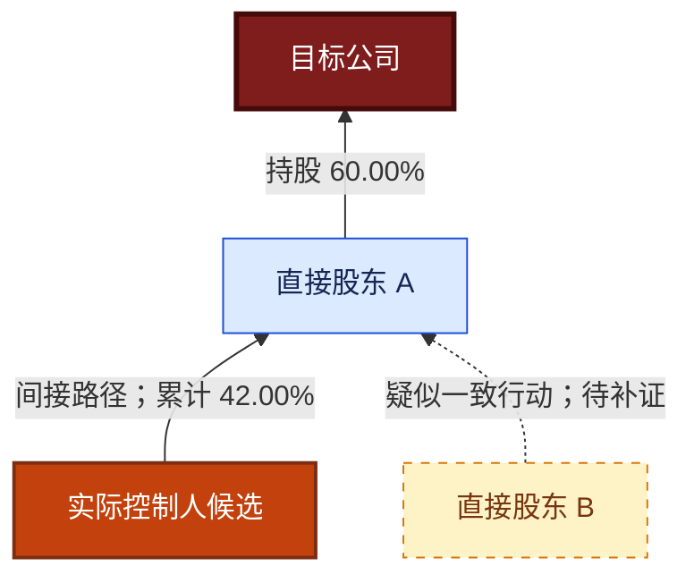

# 股权结构分析

## 目标

为投资团队生成“结论先行、图表结合、证据可追溯”的控制权核查报告。将工商事实、产品直接结论、数学计算与分析推断严格分开，不把关系线索写成已证实的一致行动或关联交易。

## 当前阶段

本技能目前是可扩展骨架。开始任务前先查看本文“CISP 产品优先级与 MCP 开发矩阵”，核对所需产品的专用 MCP 工具是否已开发：

- 核心穿透工具未就绪时，只执行现有工具支持的初步核查，并在首屏声明能力缺口。
- 不得用通用 `query_cisp_product` 冒充已完成的专用工具；它只适合联调未知产品的请求与响应。
- 缺少股权路径、比例或实际控制人产品结果时，不得宣称已完成自动多层穿透或确认实际控制人。
- 后续专用工具上线后，更新产品矩阵中的状态、工具名、输入参数、关键返回字段和实测结论，再启用对应步骤。

## 工作流

### 1. 锁定目标主体

优先使用企业全称或统一社会信用代码。名称不完整或存在歧义时，调用 `p0010068_fuzzy_search_company_name` 获取候选，再让用户或可靠标识完成消歧。调用 `p0010010_query_business_profile` 核验名称、信用代码、登记状态并取得 `basicList[].entId`；不得自行推算 `eid/entId`。

记录数据查询时点。历史时点分析必须明确基准日期；接口只有当前快照时，不得把当前股权回填为历史股权。

### 2. 建立基础事实层

调用 `p0010058_query_business_basic_deep` 获取股东、主要人员、变更、对外投资等深度工商信息。按需调用 `p0010059_query_business_basic_brief`，至少覆盖 `shareholder`、`person`、`alter`，并在风险范围内补充股权出质、冻结等工具 schema 支持的类型。

完整 DD 默认调用 `p0020021_query_single_point_related_info` 且选择投资与任职两类关系；用户明确缩小范围时再单独选择。调用 `p0990022_query_supplier_relationships` 获取供应商关联候选，但不得据此直接认定已发生关联交易。

### 3. 构建多层股权图

仅在产品矩阵标记“已开发且实测通过”后启用相应核心工具：股权穿透、最终受益人全路径、实控人和最终受益人、疑似实控人、企业间关系、多点关联及集团成员。

统一建立图数据：

- 节点：企业、自然人、合伙企业、基金/资管、国资主体、境外主体、其他组织。
- 边：直接持股、间接持股、投资、任职、法定代表人、控制、受益所有、集团、供应商及疑似关系。
- 证据：产品码、工具名、原始字段路径、查询时点；保留缺失值，不以常识补齐。
- 去重：优先按统一社会信用代码或 CISP 企业 ID 去重，名称只作次级键。

向上逐层遍历至自然人、国资终点、公开披露的分散持股上市主体、数据断点或用户指定深度。默认最大 6 层，并维护已访问节点以阻止循环。数据量过大时保留所有控制路径，普通小股东可按用户阈值折叠。

只有路径上每段持股比例都存在时，才计算单一路径的穿透持股比例：各段比例相乘。合并多条路径前检查路径独立性，无法排除重复计算时分别展示而不求和。

### 4. 核验控制权与受益所有权

按以下顺序形成结论：

1. 产品直接返回的实控人/最终受益人结论及完整路径。
2. 工商股东和穿透路径对主体、层级、比例的交叉核验。
3. 疑似实控人、共同投资任职、企业间关系和集团信息的反向验证。
4. 股权变更、出质、冻结等对控制权稳定性的影响。

分别描述股权控制、表决权/协议控制、管理层控制和受益所有权。法定代表人、董事长或最大股东身份均不能单独证明其为实际控制人。

### 5. 识别一致行动与隐性关联线索

现有产品清单没有名称明确指向“一致行动协议/一致行动人”的标准产品。仅当接口字段或可靠披露明确给出一致行动关系时，才写“已识别一致行动人”；否则写“疑似一致行动线索”，并列示触发依据，例如共同投资路径、高度重合任职、同一集团、稳定同步持股变更或产品返回的疑似关系。

将隐性关联按证据强度分层：

- A：多个独立产品一致，或直接关系产品与工商事实相互印证。
- B：单一直接产品结果，字段和主体明确。
- C：共同人员、共同投资、集团或供应商等组合线索，需要协议、流水、合同或访谈补证。

不得将同名、同地址、同电话、单次任职重合或模型推断单独写成确定关联。

### 6. 评估关联交易风险

先形成“关联方候选清单”，再检查是否存在供应、采购、资金、担保、资产转让或其他交易证据。只有关系没有交易时，写“关联交易核查对象”，不得写“存在关联交易”。

重点提示控制人交叉持股、员工/高管代持线索、共同控制、循环持股、层级过深、比例断点、突击变更、股权出质冻结、供应商与股东/高管重合等风险。

### 7. 生成报告

严格采用本文“股权结构分析报告规范”中的叙述顺序、证据标签、表格和 Mermaid 图规范。结论必须标注为以下之一：

- **事实**：工具原始结果直接支持。
- **计算**：公式、输入比例和路径完整可复算。
- **推断**：多项线索支持但缺少直接证据。
- **未知**：接口未覆盖、无结果、字段缺失或冲突未解。

报告先回答“谁控制、通过什么路径、结论有多可靠、最需要补证什么”，再展开过程。对接口冲突并列展示，不擅自选择有利结论。

## 完成条件

完整分析至少满足：目标主体唯一、核心股权路径到达合理终点、实控人与受益所有权分别核验、疑似一致行动和关联方线索已分级、图表与路径表一致、所有关键结论可回溯到产品码和字段、局限与补证清单明确。

任一核心条件不满足时交付“初步核查报告”，并明确缺失工具、数据断点和下一步，而不是降低证据标准。

## CISP 产品优先级与 MCP 开发矩阵

### 使用说明

本矩阵依据 `/Users/ice/2work/code/1_mcp/cisp-mcp/docs/prod_list.json`（480 个产品）中的产品名称，以及当前仓库 `src/cisp_mcp/interfaces.py`、`src/cisp_mcp/server.py` 的专用工具注册情况整理，基准日期为 2026-08-03。

“建议权重”总计 100%，表示该产品对本技能目标的相对贡献和开发/调用预算，不代表数据准确率、法律意义或接口可用率。产品清单没有请求参数、返回 schema、样例或字段口径；名称所暗示的能力必须在开发时通过产品文档与真实响应验证。

“已开发”仅指已有产品专用 MCP tool。通用 `query_cisp_product` 可透传任意产品码，但没有产品级 schema、参数校验和字段说明，不计为专用工具开发完成。

### 推荐组合与权重排序

| 排名 | 权重 | 产品码 | 产品名称 | 角色 | MCP 状态 | 专用工具/待开发建议名 |
| ---: | ---: | --- | --- | --- | --- | --- |
| 1 | 15% | `P0020023` | 企业股权穿透信息查询 | 多层股权主图和路径骨架 | 待开发 P0 | `p0020023_query_equity_penetration` |
| 2 | 13% | `P0020129` | 企业实控人和最终受益人查询 | 实控人与最终受益人直接结论 | 待开发 P0 | `p0020129_query_controller_and_ubo` |
| 3 | 11% | `P0090011` | 企业最终受益人信息查询-全路径版 | 受益所有权全路径及比例复核 | 待开发 P0 | `p0090011_query_ubo_full_paths` |
| 4 | 9% | `P0020044` | 企业间关联关系查询 | 核验两主体间关系路径 | 待开发 P0 | `p0020044_query_intercompany_relationship` |
| 5 | 8% | `P0020014` | 企业疑似关系信息查询 | 发现隐性关联候选 | 待开发 P0 | `p0020014_query_suspected_relationships` |
| 6 | 7% | `P0020031` | 企业多点关联信息查询 | 多主体共同路径与交叉关系 | 待开发 P0 | `p0020031_query_multi_point_relationships` |
| 7 | 7% | `P0020019` | 企业疑似实际控制人信息查询 | 实控人反向校验和异常提示 | 待开发 P0 | `p0020019_query_suspected_controller` |
| 8 | 6% | `P0010058` | 企业工商基本信息查询（深度） | 股东、人员、变更、投资的基础事实 | **已开发** | `p0010058_query_business_basic_deep` |
| 9 | 5% | `P0020021` | 企业单点关联信息查询 | 投资和任职关系扩展 | **已开发** | `p0020021_query_single_point_related_info` |
| 10 | 4% | `P0980069` | 集团成员信息查询（新企鉴） | 集团边界与成员补全 | 待开发 P1 | `p0980069_query_group_members` |
| 11 | 4% | `P0990044` | 企业股东变更信息查询 | 控制权历史变化与稳定性 | 待开发 P1 | `p0990044_query_shareholder_changes` |
| 12 | 3% | `P0010059` | 企业工商基本信息查询（简项） | 定向补充股东、人员、变更、出质冻结 | **已开发** | `p0010059_query_business_basic_brief` |
| 13 | 3% | `P0990022` | 供应商关联关系 | 关联交易候选与供应链重合线索 | **已开发** | `p0990022_query_supplier_relationships` |
| 14 | 3% | `P0010010` | 企业工商照面信息查询 | 主体核验及 `entId` 解析 | **已开发** | `p0010010_query_business_profile` |
| 15 | 2% | `P0090010` | 企业控股股东图谱（图片）信息查询 | 对自建图的视觉交叉检查 | 待开发 P2 | `p0090010_query_controlling_shareholder_graph` |

当前专用工具覆盖上述建议权重的 20%，但核心穿透、实控人和最终受益路径均未覆盖，因此不能把“20%”理解为完整技能已完成五分之一；当前只能可靠生成初步核查报告。

### 最佳调用编排

1. **主体消歧**：名称不确定时调用已开发的 `P0010068`，然后用 `P0010010` 锁定主体和 `entId`。
2. **基础并行层**：并行调用 `P0010058`、`P0010059`；完整 DD 同时调用 `P0020021`（投资+任职）和 `P0990022`。
3. **核心穿透层**：调用 `P0020023` 构建主图，调用 `P0090011` 取得最终受益人全路径，调用 `P0020129` 获得实控人/最终受益人的直接产品结论。
4. **交叉验证层**：用 `P0020019` 核查疑似实控人，用 `P0020044` 验证关键主体之间的路径，用 `P0020014` 和 `P0020031` 发现隐性或共同关系。
5. **边界与历史层**：用 `P0980069` 补集团成员，用 `P0990044` 检查股东变化，用 `P0010059` 检查股权出质、冻结和工商变更。
6. **交易风险层**：将 `P0990022` 的供应商关联与股东、实控人、董监高、集团成员交叉比对，输出关联方候选；交易事实仍需合同、流水、财务附注等补证。
7. **输出层**：以结构化数据生成 Mermaid 图；`P0090010` 的供应商图片只作交叉检查，不作为唯一事实底稿。

目标主体锁定后，第 2 层可并行；第 3 层的三个产品可并行；第 4 层应基于前三层识别出的关键主体有选择地调用，控制成本和图规模。

### 开发批次

#### P0：达到核心承诺前必须完成

- `P0020023`：确认上下穿透方向、层数/阈值、分页、节点唯一标识、每条边比例、路径 ID 和循环处理。
- `P0020129`：确认“实控人”“最终受益人”的定义、计算口径、直接/间接比例、结论依据和无实控人表达。
- `P0090011`：确认全路径结构、每段比例、累计比例、路径去重和自然人/国资/境外终点类型。
- `P0020044`：确认是否支持企业-企业、企业-自然人，关系类型、最短路径和多路径返回。
- `P0020014`：确认“疑似”的规则、证据字段和强度字段，避免把供应商黑盒评分当事实。
- `P0020031`：确认多点输入上限、共同节点、共同路径与分页/截断规则。
- `P0020019`：确认疑似实控人候选、理由、比例和置信字段。

#### P1：增强控制稳定性与集团边界

- `P0980069`：集团成员、成员角色、控制链和集团唯一标识。
- `P0990044`：变更前后股东、比例、日期和变更事项；验证是否能支持历史快照。

#### P2：可选增强

- `P0090010`：确认返回图片 URL/二进制、有效期、图例和数据时点；不替代结构化图数据。
- `P0020037`（疑似商业利益集团核心人物查询）：适合发现核心人物，但规则不透明时只作线索。
- `P0980051`（集团完整图谱信息查询）：当结构化字段优于 `P0980069` 时可替换或并用。
- `P0990041`（企业股权出资信息查询）、`P0990043`（企业股权变更信息查询）：待确认 schema 后用于实缴与历史增强。

### 同类候选与取舍

以下产品名称相关，但不应一次性全部开发。先对候选做同一企业的 schema 与结果对比，再选择字段最完整、权限稳定、非客户定制的产品：

| 能力 | 首选 | 候选/备选 | 取舍原则 |
| --- | --- | --- | --- |
| 股权穿透 | `P0020023` | `P0020016`、`P0990023` | 优先标准产品和结构化路径；`P0990023` 为“国网”命名的定制产品 |
| 最终受益人 | `P0090011` + `P0020129` | `P0020020`、`P0020024`、`P0090001`、`P0090002`、`P0090012` | 全路径用于复算，组合产品用于直接结论；详/简版仅在字段或成本更优时替换 |
| 实际控制人 | `P0020129` + `P0020019` | `P0090008`、`P0990067` | 直接结论与疑似结果交叉验证；`P0990067` 为“中证定制” |
| 最大股东链 | `P0020023` | `P0970035` | 最大股东链不能替代全部控制路径，可作低成本预筛 |
| 企业关系 | `P0020044`、`P0020014`、`P0020031` | `P0020025`、`P0020026`、`P0020039`、`P0020040`、`P0020041`、`P0990058`、`P0990059` | 优先一次返回可解释路径和证据的标准产品 |
| 集团识别 | `P0980069` | `P0020029`、`P0020030`、`P0980048`、`P0980049`、`P0980050`、`P0980051`、`P0980067`、`P0980068` | 选择集团 ID、成员角色和控制边最完整的组合，避免重复调用 |
| 股东变化 | `P0990044` | `P0080004`、`P0990043` | 优先能明确返回变更前后股东及比例的产品 |

`P0990064`/`P0990065`（泸州银行）、`P0990067`（中证）、`P0990068`（乐山商业银行）等客户定制接口，仅在账号权限、业务口径和授权范围明确时使用，不作为通用技能默认依赖。

### 当前已开发的相关工具

| 产品码 | MCP tool | 本技能用途 | 当前边界 |
| --- | --- | --- | --- |
| `P0010068` | `p0010068_fuzzy_search_company_name` | 名称消歧 | 不进入 100% 核心权重，按需调用 |
| `P0010010` | `p0010010_query_business_profile` | 主体核验、解析 `entId` | 不提供多层路径 |
| `P0010058` | `p0010058_query_business_basic_deep` | 股东、人员、投资、变更基础事实 | 返回是目标主体的深度快照，不等于完整穿透 |
| `P0010059` | `p0010059_query_business_basic_brief` | 按类型补充股东、人员、变更、出质冻结 | 需按工具 schema 选类型 |
| `P0020021` | `p0020021_query_single_point_related_info` | 投资与任职关联 | 单点关系不等于控制链 |
| `P0990022` | `p0990022_query_supplier_relationships` | 供应商关联候选 | 关系不等于交易事实 |

### MCP 工具完成验收标准

每个新产品不能只注册函数名；至少完成以下事项后，才把状态改为“已开发”：

1. 在 `interfaces.py` 建立产品定义，在 `server.py` 建立参数类型明确的专用 `@mcp.tool()`。
2. 禁止让模型通过 `extra_params` 猜核心参数；枚举值、互斥输入、分页和最大深度需在 schema/docstring 中说明并校验。
3. 返回归一化结果和原始 `data`，关键路径字段须保留产品码、原始字段路径和查询时点。
4. 对有结果、无结果、失败、超时、分页、循环持股、自然人终点、国资终点和字段缺失建立测试。
5. 用至少一家简单股权、一个多层股权、一个循环/交叉持股案例做真实接口验证，并记录上游产品异常。
6. 更新 README 工具表、smoke test 的预期工具列表和本矩阵。

### 明确的数据缺口

- 产品名称列表中没有明确的“一致行动人/一致行动协议”标准产品。技能只能识别线索，除非具体返回字段或可靠披露直接确认。
- 工商和关系产品不能证明真实交易已经发生；关联交易结论需要财务附注、合同、流水、发票、担保或访谈材料。
- 持股比例不能直接等同表决权；协议控制、委托表决、特殊表决权、合伙协议、基金管理安排和代持均需额外文件。
- 产品列表中的 `status`、`prodDist` 未附口径说明，不用它们推断产品在线状态、授权范围或质量等级。

## 股权结构分析报告规范

### 叙述逻辑

按投资决策阅读顺序组织，不按接口调用顺序堆数据：

1. **执行摘要**：一句话回答谁控制目标公司、主要控制路径、结论等级和最大风险。
2. **范围与基准**：目标主体唯一标识、查询时点、穿透方向、最大层级、股东展示阈值和数据缺口。
3. **股权与控制结构图**：先给可视化，再给关键路径表。
4. **实际控制人与最终受益人核验**：分别给直接产品结论、路径复算、交叉证据和冲突。
5. **一致行动与隐性关联线索**：明确“已证实”与“疑似”，说明证据等级。
6. **关联交易风险**：列关联方候选、关系依据、交易证据状态、风险与待核查材料。
7. **控制权稳定性**：股权变化、出质冻结、循环持股、表决权与管理层影响。
8. **待补证事项与 DD 建议**：按对投资决策的影响排序。
9. **证据索引**：产品码、工具名、原始字段路径、查询时点及异常。

### 执行摘要格式

用 4 至 8 条短结论覆盖：

- 控制人结论：`已确认 / 高概率 / 疑似 / 无法确认 / 无实际控制人`。
- 最短控制路径和关键持股比例。
- 最终受益人与实控人是否一致。
- 一致行动：`已证实 / 仅存疑似线索 / 未发现明确证据 / 未覆盖`。
- 关联交易候选数量和最高风险线索。
- 控制权稳定性与最重要的数据断点。

每条结论使用 `[事实]`、`[计算]`、`[推断]` 或 `[未知]` 标签。

### 可视化结构图

优先输出 Mermaid `flowchart BT`，让股东位于上方、目标公司位于下方。节点数量超过 30 时，输出一张控制主图，再按控制人或集团拆分附图。

建议样式：



图形规则：

- 实线仅表示产品直接返回或工商数据支持的关系。
- 虚线表示疑似关系、分析推断或待补证的一致行动线索。
- 边标签优先写直接持股比例；累计比例另标“累计”或在路径表展示。
- 未返回比例时写“比例未知”，不得省略成看似已知的控制边。
- 目标公司、控制人、企业股东、自然人、推断关系采用不同样式；同时提供文字和表格，不能让颜色成为唯一编码。
- 图片工具返回的供应商图只可作为附图；报告的结论图必须从可追溯的结构化数据生成。

### 关键控制路径表

| 路径 ID | 起点 | 完整路径 | 各段比例 | 累计比例 | 关系性质 | 证据 | 状态 |
| --- | --- | --- | --- | --- | --- | --- | --- |
| P1 | 自然人/机构 | A → B → 目标 | 70% × 60% | 42% | 间接持股 | 产品码 + 字段路径 | 事实/计算 |

累计比例计算需保留至少 4 位中间精度，展示时通常保留 2 位。任何一段缺失时累计比例为“不可计算”。

### 控制权核验表

| 候选主体 | 身份类型 | 直接持股 | 可复算间接持股 | 产品直接结论 | 非股权控制证据 | 反证/冲突 | 结论等级 |
| --- | --- | ---: | ---: | --- | --- | --- | --- |

不要为所有主体机械打分。仅在需要排序多个候选时使用解释性评分，并列明评分维度和原始事实；分数不能替代法律判断。

### 一致行动与隐性关联表

| 主体组合 | 线索类型 | 具体事实 | 证据等级 | 是否有直接协议/披露 | 对控制权影响 | 建议补证 |
| --- | --- | --- | --- | --- | --- | --- |

没有协议或明确产品字段时，将列名与正文统一写为“疑似一致行动线索”，不能简写成“一致行动人”。

### 关联交易风险表

| 关联方候选 | 与目标关系 | 交易证据 | 风险场景 | 风险等级 | 判断 | 待核查材料 |
| --- | --- | --- | --- | --- | --- | --- |

判断值限定为：`存在关系且存在交易证据`、`存在关系但交易待核查`、`仅疑似关系`、`数据不足`。关系产品或供应商关联结果本身不证明交易金额、定价公允性或利益输送。

### 证据索引

为关键结论记录：

- `evidence_id`
- `product_code`
- `tool_name`
- `queried_at`
- `subject_identifier`
- `raw_field_path`
- `raw_value_or_summary`
- `evidence_type`: `fact / calculation / inference / unknown`
- `limitations`

引用原始响应时只摘取支撑结论的字段，避免整段倾倒。不同接口冲突时，各自保留证据 ID，并在正文解释冲突及其影响。

### 中间图数据约定

后续自动化实现时，先归一化再生成图和报告。建议最小数据模型：

```json
{
  "as_of": "YYYY-MM-DDThh:mm:ss+08:00",
  "target_id": "company:<credit_code_or_eid>",
  "nodes": [
    {
      "id": "company:...",
      "type": "company|person|partnership|fund|state|overseas|other",
      "name": "...",
      "identifiers": {},
      "evidence_ids": []
    }
  ],
  "edges": [
    {
      "source": "owner_or_controller",
      "target": "owned_or_controlled",
      "type": "shareholding|investment|position|legal_representative|control|beneficial_ownership|group|supplier|suspected",
      "direct_ratio": null,
      "valid_from": null,
      "valid_to": null,
      "inferred": false,
      "evidence_ids": []
    }
  ],
  "paths": [],
  "findings": [],
  "evidence": [],
  "gaps": []
}
```

同一关系存在多来源时合并边但保留全部 `evidence_ids`。历史关系不要覆盖当前关系，使用有效期或快照分离。

### 禁止性表述

- 不因“最大股东”直接写“实际控制人”。
- 不因“法定代表人/董事长/总经理”直接写“控制公司”。
- 不因多路径简单求和而忽略重复节点、交叉持股或一致行动前提。
- 不因供应商关联、共同任职或共同地址直接写“存在关联交易/利益输送”。
- 不因接口无结果写“无该关系”；应写“本次查询未返回相关结果”。
- 不把产品黑盒结论改写成模型已独立验证的法律结论。
